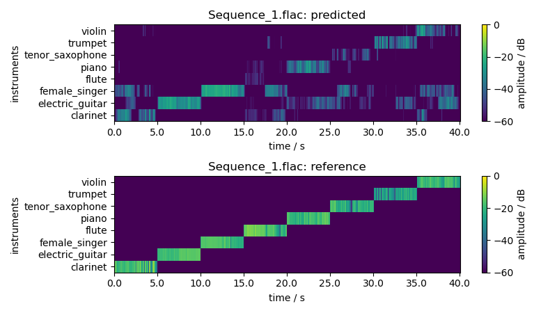
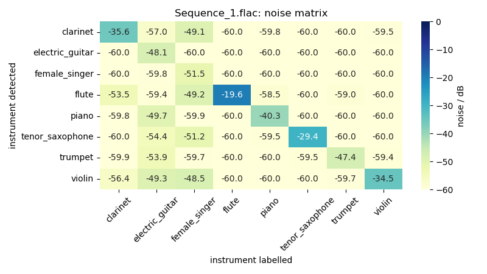

# neuroment2

Instrument detection using convolutional neural networks.

## Description

This project implements the data generation, network training and inference for instrument detection using a CNN.

The CNN comprises a simple, linear model structure. For data generation you may use different feature computation algorithms, like mel-frequency spectra or CQTs. You can predict the envelopes of different instruments in your own audio files during inference.

## Structure

- `cluster/`: Configuration files and scripts for slurm simulation clusters
- `conf/config.yaml`: Configuration file for the main application scripts
- `data/`: Directory where data may saved to and read from
- `docs/Neuroment2_Haeusler-Maier.pdf`: Official documentation
- `generate_data.py`: Main script to generate model training data
  - Configured via `conf/config.yaml`
- `inference.py`: Main script to generate predictions and output plots with a given model checkpoint for specified audio files
  - Configured via `conf/config.yaml`
- `models/`: Model checkpoints
- `neuroment2/`: Main python module for the neuroment2 project
- `parse_dataset.py`: Parses the original, unbalanced Medley-Solos-DB and generates a new, balanced version out of it
- `scripts/`: Some small scripts
- `train.py`: Main script for model training
  - Configured via `conf/config.yaml`

## Dataset

For our experiments we used the [Medley-solos-DB](https://zenodo.org/record/1344103#.YczLvNso9hE) dataset (v1.2). It contains 8 different instrument classes, sampled at 44.1kHz and with ~21k files in total. The instrument classes are (in this order):

0. clarinet
1. distorted electric guitar
2. female singer
3. flute
4. piano
5. tenor saxophone
6. trumpet
7. violin

## How to run (with examples)

Note that all 4 scripts use the [hydra](https://hydra.cc) framework for configuration. If you want to know how to easily use this framework to configure your application look [here](https://hydra.cc/docs/tutorials/basic/your_first_app/simple_cli/). All program output will be written to `outputs/` or to `multirun/` (to the latter if you supply the `-m` flag).

### Environment setup

We use the [anaconda](https://docs.anaconda.com/anaconda-repository/user-guide/tasks/pkgs/use-pkg-managers/) package manager.

1. Install anaconda/[miniconda](https://docs.conda.io/en/latest/miniconda.html) package manager
2. Install the conda environment via `conda env create -f neuroment2-cpu.yaml` (or the GPU-ready environment `neuroment2-gpu.yaml`)
3. Activate the environment via `conda activate neuroment2-cpu` (or `neuroment2-gpu`)
4. Run a script (see below)

### Parse a dataset

Parsing the original Medley-Solos DB dataset is needed in order to balance it.

We provide a small, balanced dataset in `data/medley-solos-db-small/`. Unless you plan to train your own model **for real** we advise to use this small dataset instead of parsing your own. The configuration parameters are pre-configured to use this small dataset.

- parse the original, raw dataset in order to balance it: `python parse_dataset.py parsing.input_dataset_dir=input/ parsing.output_dataset_dir=output/ parsing.max_oversampling_factor=2.0`

### Data generation

Before data generation you need to download raw audio data. We recommend to download v1.2 of the MedleySolos-DB dataset to `data/` and then specify the command line argument `Mixer.raw_data_path` with the extraction path. For testing purposes though we added a small, balanced version of the dataset in `data/medley-solos-db-small/`.

- generate data for 'training' target: `python generate_data.py`
- generate data for all dataset targets using 5 mixing epochs for 'training' data and 'MEL' features: `python generate_data.py -m Mixer.training.num_epochs=5 Mixer.pickle_path=data/pickle_5epochs Mixer.feature=MEL Mixer.data_type=validation,test,training`

### Training

- train the model for 100 epochs: `python train.py train.training_epochs=100`

### Inference

- Using the provided checkpoint: `python inference.py inference.audio_dir=data/test/ inference.model_path=models/neuroment2_cqt_00125782.model inference.predictions_dir=predictions/`
  - All predictions will be written to `predictions/`
- Using your newly created checkpoint and some of your audio files: `python inference.py inference.audio_dir=/home/thatsme/audiofiles/ inference.model_path=outputs/2022-04-25/train/models/neuroment2_00000017.model inference.predictions_dir=predictions/`

Note that the feature computation algorithm and the STFT settings will be read automatically from the model checkpoint. You don't need to specify those in the config.

## Maintainers

- [Lukas Maier](mailto:maier.lukas1995@gmail.com)
- [Lorenz Haeusler](mailto:haeusler.lorenz@gmail.com)
